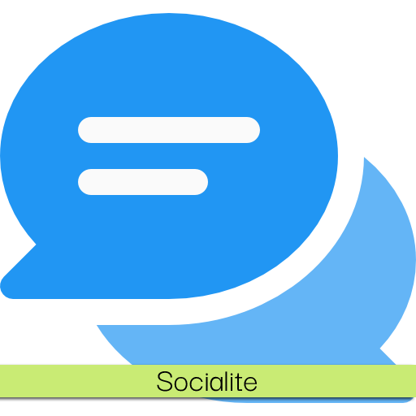

Socialite
===========

Formerly Titan Social. An LDB addon to display information about your guild members, Battle.net friends, and character friends.

## About
Socialite is an LDB plugin that combines all of your social interactions into one convenient tooltip! The end goal is to have a fully customizable and stylish display both on the Titan bar, and the plugin tool tip, while maintaining a low resource overhead and consolidation of social features. Socialite will allow you to see at a glance who is online, and streamline your communications process in-game.

## Usage
You can customize which social section(s) you would like to be displayed through Socialite by right-clicking on the data text and checking/unchecking each option. The Battle.net, Friends, and Guild components work independently of each other, if you do not want to see/display them.
